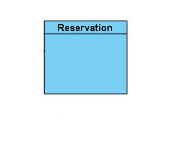

# Spécification de l'API par US

##  US1 

### Modèle du domaine
 

### Spec api

| Dev | Rôle | Description route | nom controller | nom route | url route | 
|--- |--- |--- |--- |--- |--- |
| Elyas | Admin | récupération d'un musée par id pour afficher des horaires du musée| MuseeController | getmusee | @Rest\Get("/api/musee/{id}") |

 
 
 
 

##  US2 

### Modèle du domaine

### Spec api

| Dev | Rôle | Description route | nom controller | nom route | url route | 
|--- |--- |--- |--- |--- |--- |
| Nicolas | Admin | récupération d'un bâteau par nomunique pour afficher la carte permettant de géolocaliser les 8 bateaux à flot dans le port.  | BateauController | getbateau | @Rest\Get("/api/bateaux") |

 
 
 
 

##  US3 

### Modèle du domaine

### Spec api

| Dev | Rôle | Description route | nom controller | nom route | url route | 
|--- |--- |--- |--- |--- |--- |
| Elyas | Admin | récupération d'un bâteau par nomunique pour afficher les détails d'un bateau | BateauController | getbateau | @Rest\Get("/api/bateaux/{nomunique}") |

 
 
 
 

##  US6 

### Modèle du domaine

### Spec api

| Dev | Rôle | Description route | nom controller | nom route | url route | 
|--- |--- |--- |--- |--- |--- |
| Tania | Admin | liste des bateaux | BateauController | listebateaux | @Rest\Get("/api/bateaux") |

 
 
 
 

##  US7 

### Modèle du domaine

### Spec api

| Dev | Rôle | Description route | nom controller | nom route | url route | 
|--- |--- |--- |--- |--- |--- |
| Nhan | Admin | témoignages d'un bâteau | TemoignageController | gettemoignage | @Rest\Get("/api/bateaux/{nomunique}/temoignages") |

 
 
 
 

##  US8 

### Modèle du domaine

### Spec api

| Dev | Rôle | Description route | nom controller | nom route | url route | 
|--- |--- |--- |--- |--- |--- |
| Tania | Admin | planning d'un bateau | PlanningController | getplanning | @Rest\Get("/api/bateaux/{nomunique}/planning") |

 
 
 
 

##  US9 

### Modèle du domaine

### Spec api

| Dev | Rôle | Description route | nom controller | nom route | url route | 
|--- |--- |--- |--- |--- |--- |
| Nicolas | Admin | récupération du planning pour la réservation d'un bateau | PlanningController | getplanning | @REST\Get("/api/bateaux/{nomunique}/planning") |
| Nicolas | Admin | modification du nombre de place restante dans le planning du bateau | PlanningController | updateCreneauNbPlace | @Rest\Patch("/api/bateaux/{nomunique}/planning/creneau/{id}") |

 
 

### Diagramme de classe
